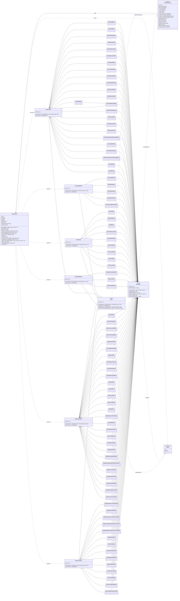

```mermaid
classDiagram
  direction LR

  class TrustEvaluator {
    +model
    +train_data
    +test_data
    +factsheet
    +output_path: str
    +config: dict
    +context: EvaluationContext
    +result: dict | None
    +evaluate(pillars: list[str], show_nan: bool) dict
    +plot_results() None
    +plot_radar() None
    +compare_all_bars(results: dict[str, dict]) None
    +compare_radar(results: dict[str, dict]) None
    -_load_config(config_path: str | None) dict
    -_build_context() EvaluationContext
    -_predict(X)
    -_predict_proba(X)
    -_compute_pillar_scores(pillars: list[str] | None) dict
    -_compute_trust_score(pillar_scores: dict) float
    -_build_score_explanation(pillar_results: dict, show_nan: bool) dict
    -_save_result() None
    -_validate_pillars(pillars: list[str]) None
    -_is_nan(value)
  }

  class BaseMetric {
    <<abstract>>
    +metric_key: str
    +score_config_key: str | None
    +evaluate(context, config: dict | None) Result
    +compute(context) dict
    +build_properties(raw: dict) dict
    +compute_score(raw: dict, config: dict | None) int
    +custom_score(raw: dict)
    -_get_thresholds(config: dict | None)
  }

  class Pillar {
    <<abstract>>
    +pillar_key: str
    +prepare(context: EvaluationContext, config: dict[str, Any]) None
    +get_metrics() List~BaseMetric~
    +analyse(context: EvaluationContext, config: dict[str, dict]) Result
    +score(context: EvaluationContext, config: dict) Tuple~float, Result~
  }

  class EvaluationContext {
    <<dataclass>>
    +model: Any
    +train_data: DataFrame
    +test_data: DataFrame
    +X_train: DataFrame
    +X_test: DataFrame
    +y_train: ndarray
    +y_test: ndarray
    +y_pred_train: ndarray | DataFrame
    +y_pred_test: ndarray | DataFrame
    +y_prob_train: ndarray | DataFrame | None
    +y_prob_test: ndarray | DataFrame | None
    +factsheet: dict[str, Any]
    +extras: dict[str, Any]
    +group_mask: ndarray
    +protected_feature: str
    +protected_values: list[Any]
    +target_column: str
    +favorable_outcomes: list[Any]
    +y_prob_positive: ndarray | None
  }

  class Result {
    <<NamedTuple>>
    +score
    +properties
  }

  class FairnessPillar {
    +pillar_key: str
    +prepare(context: EvaluationContext, config: dict[str, Any]) None
    +get_metrics() List~BaseMetric~
  }

  class AccountabilityPillar {
    +pillar_key: str
    +prepare(context: EvaluationContext, config: dict[str, Any]) None
    +get_metrics() List~BaseMetric~
  }

  class PrivacyPillar {
    +pillar_key: str
    +prepare(context: EvaluationContext, config: dict[str, Any]) None
    +get_metrics() List~BaseMetric~
  }

  class SustainabilityPillar {
    +pillar_key: str
    +prepare(context: EvaluationContext, config: dict[str, Any]) None
    +get_metrics() List~BaseMetric~
  }

  class ExplainabilityPillar {
    +pillar_key: str
    +prepare(context: EvaluationContext, config: dict[str, Any]) None
    +get_metrics() List~BaseMetric~
  }

  class RobustnessPillar {
    +pillar_key: str
    +prepare(context: EvaluationContext, config: dict[str, Any]) None
    +get_metrics() List~BaseMetric~
  }

  TrustEvaluator *-- EvaluationContext : builds
  TrustEvaluator ..> FairnessPillar : _PILLARS
  TrustEvaluator ..> AccountabilityPillar : _PILLARS
  TrustEvaluator ..> PrivacyPillar : _PILLARS
  TrustEvaluator ..> SustainabilityPillar : _PILLARS
  TrustEvaluator ..> ExplainabilityPillar : _PILLARS
  TrustEvaluator ..> RobustnessPillar : _PILLARS

  TrustEvaluator ..> Result : returns
  Pillar ..> Result : analyse()/score()
  BaseMetric ..> Result : evaluate()
  Pillar ..> EvaluationContext : prepare/analyse/score
  BaseMetric ..> EvaluationContext : compute(context)

  FairnessPillar --|> Pillar
  AccountabilityPillar --|> Pillar
  PrivacyPillar --|> Pillar
  SustainabilityPillar --|> Pillar
  ExplainabilityPillar --|> Pillar
  RobustnessPillar --|> Pillar

  %% Fairness metrics
  class UnderfittingMetric
  class OverfittingMetric
  class StatisticalParityMetric
  class ClassBalanceMetric
  class DisparateImpactMetric
  class EqualOpportunityMetric
  class AverageOddsMetric
  class AccuracyParityMetric
  class PredictiveParityMetric
  class TreatmentEqualityMetric
  class CalibrationGapMetric
  class WellCalibrationMetric
  class GeneralizedEntropyMetric
  class TheilIndexMetric
  class CoefficientVariationMetric
  class ConsistencyMetric
  class ClassImbalanceMetric
  class KLDivergenceMetric
  class ConditionalDemographicDisparityMetric
  class SmoothedEDFMetric
  class BiasAmplificationMetric
  class BetweenGroupGeneralizedEntropyMetric
  class CohensDMetric
  class ZTestDiffMetric

  %% Accountability metrics
  class TrainTestSplitMetric
  class MissingDataMetric
  class NormalizationMetric
  class RegularizationMetric
  class FactsheetCompletenessMetric

  %% Privacy metrics
  class EpsilonMetric
  class EpsilonStarMetric
  class SHAPRMetric
  class AttributeInferenceMetric
  class AccuracyRatioMetric
  class PrivacyRiskMetric
  class KAnonymityMetric
  class LDiversityMetric
  class TClosenessMetric

  %% Sustainability metrics
  class EnergyConsumptionMetric
  class EmissionsMetric
  class CarbonIntensityMetric

  %% Explainability metrics
  class SparsityMetric
  class FeatureEntropyMetric
  class TopKConcentrationMetric
  class InteractionStrengthMetric
  class AlgorithmClassMetric
  class CorrelatedFeaturesMetric
  class ModelSizeMetric
  class FeatureRelevanceMetric
  class NumberOfRulesMetric
  class AverageRuleLengthMetric
  class RuleStatsMetric
  class TreeDepthMetric
  class FaithfulnessMetric
  class MonotonicityMetric
  class InfidelityMetric
  class AlphaImportanceScoreMetric
  class SpreadRatioMetric
  class SpreadDivergenceMetric
  class PositionParityMetric
  class RankAlignmentMetric
  class XAIEaseScoreMetric
  class WeightedAverageDepthMetric
  class WeightedAverageExplainabilityScoreMetric
  class WeightedTreeGiniMetric
  class TreeDepthVarianceMetric
  class TreeNumberOfRulesMetric
  class TreeNumberOfFeaturesMetric
  class XAIConsistencyScoreMetric

  %% Robustness metrics
  class HopSkipJumpAccuracyDropMetric
  class HopSkipJumpASRMetric
  class HopSkipJumpAdversarialAccuracyMetric
  class HopSkipJumpEmpiricalRobustnessL2Metric
  class HopSkipJumpEmpiricalRobustnessLinfMetric
  class CliqueMethodMetric
  class CleverScoreMetric
  class FastGradientAttackMetric
  class CarliniWagnerAttackMetric
  class DeepFoolAttackMetric
  class ConfidenceScoreMetric
  class LossSensitivityMetric
  class RobustnessRatioHSJMetric
  class ExpectedCalibrationErrorMetric

  %% Metric inheritance
  UnderfittingMetric --|> BaseMetric
  OverfittingMetric --|> BaseMetric
  StatisticalParityMetric --|> BaseMetric
  ClassBalanceMetric --|> BaseMetric
  DisparateImpactMetric --|> BaseMetric
  EqualOpportunityMetric --|> BaseMetric
  AverageOddsMetric --|> BaseMetric
  AccuracyParityMetric --|> BaseMetric
  PredictiveParityMetric --|> BaseMetric
  TreatmentEqualityMetric --|> BaseMetric
  CalibrationGapMetric --|> BaseMetric
  WellCalibrationMetric --|> BaseMetric
  GeneralizedEntropyMetric --|> BaseMetric
  TheilIndexMetric --|> GeneralizedEntropyMetric
  CoefficientVariationMetric --|> BaseMetric
  ConsistencyMetric --|> BaseMetric
  ClassImbalanceMetric --|> BaseMetric
  KLDivergenceMetric --|> BaseMetric
  ConditionalDemographicDisparityMetric --|> BaseMetric
  SmoothedEDFMetric --|> BaseMetric
  BiasAmplificationMetric --|> BaseMetric
  BetweenGroupGeneralizedEntropyMetric --|> BaseMetric
  CohensDMetric --|> BaseMetric
  ZTestDiffMetric --|> BaseMetric

  TrainTestSplitMetric --|> BaseMetric
  MissingDataMetric --|> BaseMetric
  NormalizationMetric --|> BaseMetric
  RegularizationMetric --|> BaseMetric
  FactsheetCompletenessMetric --|> BaseMetric

  EpsilonMetric --|> BaseMetric
  EpsilonStarMetric --|> BaseMetric
  SHAPRMetric --|> BaseMetric
  AttributeInferenceMetric --|> BaseMetric
  AccuracyRatioMetric --|> BaseMetric
  PrivacyRiskMetric --|> BaseMetric
  KAnonymityMetric --|> BaseMetric
  LDiversityMetric --|> BaseMetric
  TClosenessMetric --|> BaseMetric

  EnergyConsumptionMetric --|> BaseMetric
  EmissionsMetric --|> BaseMetric
  CarbonIntensityMetric --|> BaseMetric

  SparsityMetric --|> BaseMetric
  FeatureEntropyMetric --|> BaseMetric
  TopKConcentrationMetric --|> BaseMetric
  InteractionStrengthMetric --|> BaseMetric
  AlgorithmClassMetric --|> BaseMetric
  CorrelatedFeaturesMetric --|> BaseMetric
  ModelSizeMetric --|> BaseMetric
  FeatureRelevanceMetric --|> BaseMetric
  NumberOfRulesMetric --|> BaseMetric
  AverageRuleLengthMetric --|> BaseMetric
  RuleStatsMetric --|> BaseMetric
  TreeDepthMetric --|> BaseMetric
  FaithfulnessMetric --|> BaseMetric
  MonotonicityMetric --|> BaseMetric
  InfidelityMetric --|> BaseMetric
  AlphaImportanceScoreMetric --|> BaseMetric
  SpreadRatioMetric --|> BaseMetric
  SpreadDivergenceMetric --|> BaseMetric
  PositionParityMetric --|> BaseMetric
  RankAlignmentMetric --|> BaseMetric
  XAIEaseScoreMetric --|> BaseMetric
  WeightedAverageDepthMetric --|> BaseMetric
  WeightedAverageExplainabilityScoreMetric --|> BaseMetric
  WeightedTreeGiniMetric --|> BaseMetric
  TreeDepthVarianceMetric --|> BaseMetric
  TreeNumberOfRulesMetric --|> BaseMetric
  TreeNumberOfFeaturesMetric --|> BaseMetric
  XAIConsistencyScoreMetric --|> BaseMetric

  HopSkipJumpAccuracyDropMetric --|> BaseMetric
  HopSkipJumpASRMetric --|> BaseMetric
  HopSkipJumpAdversarialAccuracyMetric --|> BaseMetric
  HopSkipJumpEmpiricalRobustnessL2Metric --|> BaseMetric
  HopSkipJumpEmpiricalRobustnessLinfMetric --|> BaseMetric
  CliqueMethodMetric --|> BaseMetric
  CleverScoreMetric --|> BaseMetric
  FastGradientAttackMetric --|> BaseMetric
  CarliniWagnerAttackMetric --|> BaseMetric
  DeepFoolAttackMetric --|> BaseMetric
  ConfidenceScoreMetric --|> BaseMetric
  LossSensitivityMetric --|> BaseMetric
  RobustnessRatioHSJMetric --|> BaseMetric
  ExpectedCalibrationErrorMetric --|> BaseMetric

  %% Pillar to metrics (composition)
  FairnessPillar o-- UnderfittingMetric
  FairnessPillar o-- OverfittingMetric
  FairnessPillar o-- StatisticalParityMetric
  FairnessPillar o-- ClassBalanceMetric
  FairnessPillar o-- DisparateImpactMetric
  FairnessPillar o-- EqualOpportunityMetric
  FairnessPillar o-- AverageOddsMetric
  FairnessPillar o-- AccuracyParityMetric
  FairnessPillar o-- PredictiveParityMetric
  FairnessPillar o-- TreatmentEqualityMetric
  FairnessPillar o-- CalibrationGapMetric
  FairnessPillar o-- WellCalibrationMetric
  FairnessPillar o-- GeneralizedEntropyMetric
  FairnessPillar o-- TheilIndexMetric
  FairnessPillar o-- CoefficientVariationMetric
  FairnessPillar o-- ConsistencyMetric
  FairnessPillar o-- ClassImbalanceMetric
  FairnessPillar o-- KLDivergenceMetric
  FairnessPillar o-- ConditionalDemographicDisparityMetric
  FairnessPillar o-- SmoothedEDFMetric
  FairnessPillar o-- BiasAmplificationMetric
  FairnessPillar o-- BetweenGroupGeneralizedEntropyMetric
  FairnessPillar o-- CohensDMetric
  FairnessPillar o-- ZTestDiffMetric

  AccountabilityPillar o-- TrainTestSplitMetric
  AccountabilityPillar o-- MissingDataMetric
  AccountabilityPillar o-- NormalizationMetric
  AccountabilityPillar o-- RegularizationMetric
  AccountabilityPillar o-- FactsheetCompletenessMetric

  PrivacyPillar o-- EpsilonMetric
  PrivacyPillar o-- EpsilonStarMetric
  PrivacyPillar o-- SHAPRMetric
  PrivacyPillar o-- AttributeInferenceMetric
  PrivacyPillar o-- AccuracyRatioMetric
  PrivacyPillar o-- PrivacyRiskMetric
  PrivacyPillar o-- KAnonymityMetric
  PrivacyPillar o-- LDiversityMetric
  PrivacyPillar o-- TClosenessMetric

  SustainabilityPillar o-- EnergyConsumptionMetric
  SustainabilityPillar o-- EmissionsMetric
  SustainabilityPillar o-- CarbonIntensityMetric

  ExplainabilityPillar o-- SparsityMetric
  ExplainabilityPillar o-- FeatureEntropyMetric
  ExplainabilityPillar o-- TopKConcentrationMetric
  ExplainabilityPillar o-- InteractionStrengthMetric
  ExplainabilityPillar o-- AlgorithmClassMetric
  ExplainabilityPillar o-- CorrelatedFeaturesMetric
  ExplainabilityPillar o-- ModelSizeMetric
  ExplainabilityPillar o-- FeatureRelevanceMetric
  ExplainabilityPillar o-- NumberOfRulesMetric
  ExplainabilityPillar o-- AverageRuleLengthMetric
  ExplainabilityPillar o-- RuleStatsMetric
  ExplainabilityPillar o-- TreeDepthMetric
  ExplainabilityPillar o-- FaithfulnessMetric
  ExplainabilityPillar o-- MonotonicityMetric
  ExplainabilityPillar o-- InfidelityMetric
  ExplainabilityPillar o-- AlphaImportanceScoreMetric
  ExplainabilityPillar o-- SpreadRatioMetric
  ExplainabilityPillar o-- SpreadDivergenceMetric
  ExplainabilityPillar o-- PositionParityMetric
  ExplainabilityPillar o-- RankAlignmentMetric
  ExplainabilityPillar o-- XAIEaseScoreMetric
  ExplainabilityPillar o-- WeightedAverageDepthMetric
  ExplainabilityPillar o-- WeightedAverageExplainabilityScoreMetric
  ExplainabilityPillar o-- WeightedTreeGiniMetric
  ExplainabilityPillar o-- TreeDepthVarianceMetric
  ExplainabilityPillar o-- TreeNumberOfRulesMetric
  ExplainabilityPillar o-- TreeNumberOfFeaturesMetric
  ExplainabilityPillar o-- XAIConsistencyScoreMetric

  RobustnessPillar o-- HopSkipJumpAccuracyDropMetric
  RobustnessPillar o-- HopSkipJumpASRMetric
  RobustnessPillar o-- HopSkipJumpAdversarialAccuracyMetric
  RobustnessPillar o-- HopSkipJumpEmpiricalRobustnessL2Metric
  RobustnessPillar o-- HopSkipJumpEmpiricalRobustnessLinfMetric
  RobustnessPillar o-- CliqueMethodMetric
  RobustnessPillar o-- CleverScoreMetric
  RobustnessPillar o-- FastGradientAttackMetric
  RobustnessPillar o-- CarliniWagnerAttackMetric
  RobustnessPillar o-- DeepFoolAttackMetric
  RobustnessPillar o-- ConfidenceScoreMetric
  RobustnessPillar o-- LossSensitivityMetric
  RobustnessPillar o-- RobustnessRatioHSJMetric
  RobustnessPillar o-- ExpectedCalibrationErrorMetric
```