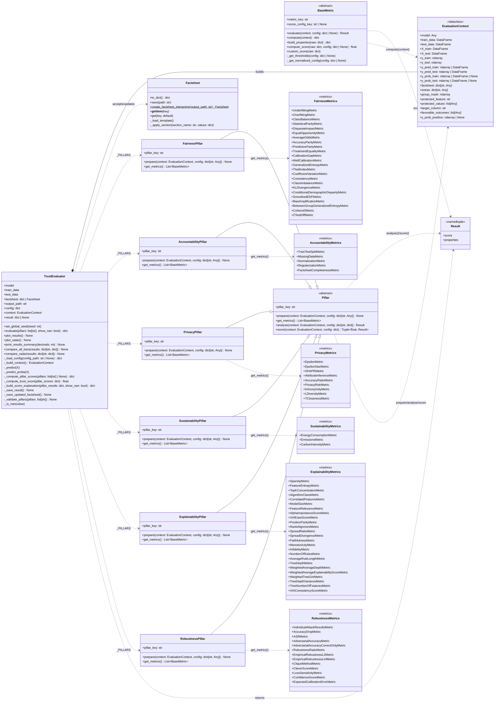

```mermaid
classDiagram
  direction LR

  class TrustEvaluator {
    +model
    +train_data
    +test_data
    +factsheet: dict | Factsheet
    +output_path: str
    +config: dict
    +context: EvaluationContext
    +result: dict | None
    +set_global_seed(seed: int)
    +evaluate(pillars: list[str], show_nan: bool) dict
    +plot_results() None
    +plot_radar() None
    +print_results_summary(decimals: int) None
    +compare_all_bars(results: dict[str, dict]) None
    +compare_radar(results: dict[str, dict]) None
    -_load_config(config_path: str | None) dict
    -_build_context() EvaluationContext
    -_predict(X)
    -_predict_proba(X)
    -_compute_pillar_scores(pillars: list[str] | None) dict
    -_compute_trust_score(pillar_scores: dict) float
    -_build_score_explanation(pillar_results: dict, show_nan: bool) dict
    -_save_result() None
    -_save_updated_factsheet() None
    -_validate_pillars(pillars: list[str]) None
    -_is_nan(value)
  }

  class Factsheet {
    +to_dict() dict
    +save(path: str)
    +create_factsheet_interactive(output_path: str)$ Factsheet
    +__getitem__(key)
    +get(key, default)
    -_load_template()
    -_apply_section(section_name: str, values: dict)
  }

  class BaseMetric {
    <<abstract>>
    +metric_key: str
    +score_config_key: str | None
    +evaluate(context, config: dict | None) Result
    +compute(context) dict
    +build_properties(raw: dict) dict
    +compute_score(raw: dict, config: dict | None) float
    +custom_score(raw: dict)
    -_get_thresholds(config: dict | None)
    -_get_normalized_config(config: dict | None)
  }

  class Pillar {
    <<abstract>>
    +pillar_key: str
    +prepare(context: EvaluationContext, config: dict[str, Any]) None
    +get_metrics() List~BaseMetric~
    +analyse(context: EvaluationContext, config: dict[str, dict]) Result
    +score(context: EvaluationContext, config: dict) Tuple~float, Result~
  }

  class EvaluationContext {
    <<dataclass>>
    +model: Any
    +train_data: DataFrame
    +test_data: DataFrame
    +X_train: DataFrame
    +X_test: DataFrame
    +y_train: ndarray
    +y_test: ndarray
    +y_pred_train: ndarray | DataFrame
    +y_pred_test: ndarray | DataFrame
    +y_prob_train: ndarray | DataFrame | None
    +y_prob_test: ndarray | DataFrame | None
    +factsheet: dict[str, Any]
    +extras: dict[str, Any]
    +group_mask: ndarray
    +protected_feature: str
    +protected_values: list[Any]
    +target_column: str
    +favorable_outcomes: list[Any]
    +y_prob_positive: ndarray | None
  }

  class Result {
    <<namedtuple>>
    +score
    +properties
  }

  class FairnessPillar {
    +pillar_key: str
    +prepare(context: EvaluationContext, config: dict[str, Any]) None
    +get_metrics() List~BaseMetric~
  }

  class AccountabilityPillar {
    +pillar_key: str
    +prepare(context: EvaluationContext, config: dict[str, Any]) None
    +get_metrics() List~BaseMetric~
  }

  class PrivacyPillar {
    +pillar_key: str
    +prepare(context: EvaluationContext, config: dict[str, Any]) None
    +get_metrics() List~BaseMetric~
  }

  class SustainabilityPillar {
    +pillar_key: str
    +prepare(context: EvaluationContext, config: dict[str, Any]) None
    +get_metrics() List~BaseMetric~
  }

  class ExplainabilityPillar {
    +pillar_key: str
    +prepare(context: EvaluationContext, config: dict[str, Any]) None
    +get_metrics() List~BaseMetric~
  }

  class RobustnessPillar {
    +pillar_key: str
    +prepare(context: EvaluationContext, config: dict[str, Any]) None
    +get_metrics() List~BaseMetric~
  }

  class FairnessMetrics {
    <<metrics>>
    +UnderfittingMetric
    +OverfittingMetric
    +ClassBalanceMetric
    +StatisticalParityMetric
    +DisparateImpactMetric
    +EqualOpportunityMetric
    +AverageOddsMetric
    +AccuracyParityMetric
    +PredictiveParityMetric
    +TreatmentEqualityMetric
    +CalibrationGapMetric
    +WellCalibrationMetric
    +GeneralizedEntropyMetric
    +TheilIndexMetric
    +CoefficientVariationMetric
    +ConsistencyMetric
    +ClassImbalanceMetric
    +KLDivergenceMetric
    +ConditionalDemographicDisparityMetric
    +SmoothedEDFMetric
    +BiasAmplificationMetric
    +BetweenGroupGeneralizedEntropyMetric
    +CohensDMetric
    +ZTestDiffMetric
  }

  class AccountabilityMetrics {
    <<metrics>>
    +TrainTestSplitMetric
    +MissingDataMetric
    +NormalizationMetric
    +RegularizationMetric
    +FactsheetCompletenessMetric
  }

  class PrivacyMetrics {
    <<metrics>>
    +EpsilonMetric
    +EpsilonStarMetric
    +SHAPRMetric
    +AttributeInferenceMetric
    +AccuracyRatioMetric
    +PrivacyRiskMetric
    +KAnonymityMetric
    +LDiversityMetric
    +TClosenessMetric
  }

  class SustainabilityMetrics {
    <<metrics>>
    +EnergyConsumptionMetric
    +EmissionsMetric
    +CarbonIntensityMetric
  }

  class ExplainabilityMetrics {
    <<metrics>>
    +SparsityMetric
    +FeatureEntropyMetric
    +TopKConcentrationMetric
    +AlgorithmClassMetric
    +CorrelatedFeaturesMetric
    +ModelSizeMetric
    +FeatureRelevanceMetric
    +AlphaImportanceScoreMetric
    +XAIEaseScoreMetric
    +PositionParityMetric
    +RankAlignmentMetric
    +SpreadRatioMetric
    +SpreadDivergenceMetric
    +FaithfulnessMetric
    +MonotonicityMetric
    +InfidelityMetric
    +NumberOfRulesMetric
    +AverageRuleLengthMetric
    +TreeDepthMetric
    +WeightedAverageDepthMetric
    +WeightedAverageExplainabilityScoreMetric
    +WeightedTreeGiniMetric
    +TreeDepthVarianceMetric
    +TreeNumberOfFeaturesMetric
    +XAIConsistencyScoreMetric
  }

  class RobustnessMetrics {
    <<metrics>>
    +IndividualAttackResultsMetric
    +AccuracyDropMetric
    +ASRMetric
    +AdversarialAccuracyMetric
    +AdversarialAccuracyCorrectOnlyMetric
    +RobustnessRatioMetric
    +EmpiricalRobustnessL2Metric
    +EmpiricalRobustnessLinfMetric
    +CliqueMethodMetric
    +CleverScoreMetric
    +LossSensitivityMetric
    +ConfidenceScoreMetric
    +ExpectedCalibrationErrorMetric
  }

  TrustEvaluator *-- EvaluationContext : builds
  TrustEvaluator ..> Factsheet : accepts/updates
  TrustEvaluator ..> FairnessPillar : _PILLARS
  TrustEvaluator ..> AccountabilityPillar : _PILLARS
  TrustEvaluator ..> PrivacyPillar : _PILLARS
  TrustEvaluator ..> SustainabilityPillar : _PILLARS
  TrustEvaluator ..> ExplainabilityPillar : _PILLARS
  TrustEvaluator ..> RobustnessPillar : _PILLARS

  TrustEvaluator ..> Result : returns
  Pillar ..> Result : analyse()/score()
  BaseMetric ..> Result : evaluate()
  Pillar ..> EvaluationContext : prepare/analyse/score
  BaseMetric ..> EvaluationContext : compute(context)

  FairnessPillar --|> Pillar
  AccountabilityPillar --|> Pillar
  PrivacyPillar --|> Pillar
  SustainabilityPillar --|> Pillar
  ExplainabilityPillar --|> Pillar
  RobustnessPillar --|> Pillar

  FairnessPillar ..> FairnessMetrics : get_metrics()
  AccountabilityPillar ..> AccountabilityMetrics : get_metrics()
  PrivacyPillar ..> PrivacyMetrics : get_metrics()
  SustainabilityPillar ..> SustainabilityMetrics : get_metrics()
  ExplainabilityPillar ..> ExplainabilityMetrics : get_metrics()
  RobustnessPillar ..> RobustnessMetrics : get_metrics()


```